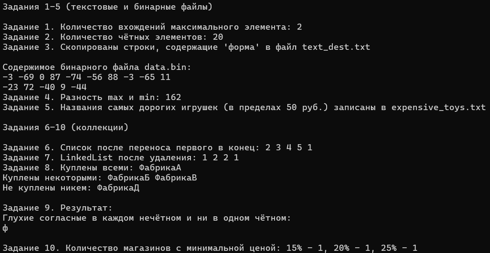

# Никифоров Егор КМБ\_2 Лабораторная №7

## Задание 1. Текстовые файлы

### Текст задачи
Подсчитать количество вхождений максимального элемента в файл (числа по одному в строке).

### Алгоритм решения
1. Метод `FillTextFileSingleInt` создаёт текстовый файл, заполняя его случайными целыми числами от -100 до 100 (по одному в строке).
2. Метод `Task1_CountMaxOccurrences`:
   - Читает файл построчно через `StreamReader`.
   - Для каждой строки пытается преобразовать её в `int` (`int.TryParse`).
   - Отслеживает текущий максимум и счётчик его вхождений.
   - Возвращает количество вхождений максимального числа.

## Задание 2. Текстовые файлы

### Текст задачи
Вычислить количество чётных элементов в файле, где в строке может быть несколько чисел через пробел.

### Алгоритм решения
1. Метод `FillTextFileMultipleInts` создаёт файл с заданным количеством строк и чисел в строке (через пробел).
2. Метод `Task2_CountEvenNumbers`:
   - Читает файл построчно.
   - Разбивает строку на части методом `Split(' ')`.
   - Для каждой части проверяет, является ли число чётным (`number % 2 == 0`).
   - Суммирует количество чётных чисел.

## Задание 3. Текстовые файлы

### Текст задачи
Переписать в другой файл строки, содержащие заданную комбинацию символов (например, «форма»).

### Алгоритм решения
1. Метод `FillTextFileWithText` создаёт исходный текстовый файл из переданного массива строк.
2. Метод `Task3_CopyLinesContaining`:
   - Открывает исходный файл на чтение и выходной на запись.
   - Для каждой строки проверяет, содержит ли она подстроку (`line.Contains(substring)`).
   - Если содержит – записывает строку в выходной файл.

## Задание 4. Бинарные файлы

### Текст задачи
Найти разность максимального и минимального элементов заданного бинарного файла (файл содержит целые числа).

### Алгоритм решения
1. Метод `FillBinaryFileWithInts` создаёт бинарный файл, записывая в него случайные целые числа (через `BinaryWriter`).
2. Метод `Task4_MaxMinDifference`:
   - Открывает файл через `BinaryReader`.
   - Читает все числа (`ReadInt32`) до конца потока.
   - Находит минимальное и максимальное значение.
   - Возвращает разность `max - min`.

## Задание 5. Бинарные файлы и структуры

### Текст задачи
Файл содержит сведения об игрушках: название, стоимость (в рублях), возрастные границы (от и до).  
Вывести названия наиболее дорогих игрушек (цена которых отличается от цены самой дорогой игрушки не более чем на k руб.).

### Алгоритм решения
1. Определена структура `Toy` с полями `Name`, `Cost`, `AgeMin`, `AgeMax`. В свойствах добавлены проверки на отрицательные значения и корректность диапазона.
2. Метод `FillBinaryFileWithToys` создаёт XML-файл, содержащий список игрушек со случайными параметрами.
3. Метод `Task5_MostExpensiveToys`:
   - Десериализует список игрушек из XML-файла (`XmlSerializer`).
   - Находит максимальную стоимость среди всех игрушек.
   - Записывает в выходной текстовый файл названия игрушек, у которых `maxCost - Cost <= k`.

## Задание 6. List

### Текст задачи
Составить программу, которая переносит в конец непустого списка L его первый элемент.

### Алгоритм решения
Метод `Task6_MoveFirstToEnd`:
- Проверяет, что список не `null` и не пуст.
- Сохраняет первый элемент.
- Сдвигает все элементы влево (цикл `for`).
- Записывает сохранённый элемент в конец списка.

## Задание 7. LinkedList

### Текст задачи
Из списка L, содержащего не менее двух элементов, удалить все элементы, у которых одинаковые «соседи» (первый и последний элементы считать соседями).

### Алгоритм решения
Метод `Task7_RemoveElementsWithSameNeighbors`:
- Для пустого списка или списка из одного элемента – выход.
- Запоминает первый и последний узлы.
- Обходит список, для каждого узла определяет левого и правого соседа (для первого – последний, для последнего – первый).
- Если значения соседей равны, узел добавляется во временный список на удаление.
- После обхода удаляет все помеченные узлы.

## Задание 8. HashSet

### Текст задачи
Есть перечень мебельных фабрик. Известно, мебель каких фабрик приобреталась n покупателями.  
Определить для каждой фабрики, мебель каких из них приобреталась **всеми** покупателями, каких – **некоторыми** из покупателей, и каких – **никем** из покупателей.

### Алгоритм решения
Метод `Task8_FurnitureAnalysis`:
- Создаёт словарь `Dictionary<string, HashSet<int>>`, где ключ – фабрика, значение – множество номеров покупателей, купивших эту фабрику.
- Инициализирует словарь всеми фабриками из перечня (пустые множества).
- Для каждого покупателя (индекс i) перебирает купленные им фабрики и добавляет i в соответствующее множество.
- После обработки всех покупателей для каждой фабрики проверяет количество уникальных покупателей:
  - равно общему числу покупателей → фабрика в `allBoughtByEveryone`.
  - больше 0, но меньше общего числа → фабрика в `boughtBySome`.
  - равно 0 → фабрика в `boughtByNone`.
- Результат возвращается через три выходных параметра (`HashSet<string>`).

## Задание 9. HashSet

### Текст задачи
Файл содержит текст на русском языке. Напечатать в алфавитном порядке все глухие согласные буквы, которые входят в **каждое нечётное** слово и **не входят** ни в одно чётное слово.

### Алгоритм решения
Метод `Task9_PrintVoicelessConsonants`:
- Читает весь текст из файла (`File.ReadAllText`).
- Разбивает текст на слова по разделителям (пробелы, знаки препинания, переводы строк) без LINQ.
- Определяет массив глухих согласных (к, п, с, т, ф, х, ц, ч, ш, щ).
- Создаёт `HashSet<char>` для хранения подходящих букв.
- Первый проход (нечётные слова – индексы 0,2,4,...): для каждого слова приводит его к нижнему регистру и проверяет наличие каждой глухой согласной; если есть – добавляет в множество.
- Второй проход (чётные слова – индексы 1,3,5,...): если буква встречается в чётном слове – удаляет её из множества.
- Оставшиеся буквы копирует в `List<char>` и сортирует пузырьковым методом (без LINQ).
- Выводит отсортированные буквы через пробел.

## Задание 10. Dictionary или SortedList

### Текст задачи
В молочных магазинах города Х продаётся сметана с жирностью 15, 20 и 25 процентов. Проведён мониторинг цен (в копейках).  
Определить для каждого вида сметаны, сколько магазинов продают её **дешевле всего**.  
Входные данные: сначала число магазинов N, затем N строк формата `<Фирма> <Улица> <Жирность> <Цена>`.  
Выход: три числа – количество магазинов с минимальной ценой для жирности 15, 20, 25.

### Алгоритм решения
Метод `Task10_SourCreamAnalysis`:
- Читает файл через `StreamReader`.
- Первая строка – число магазинов N.
- Инициализирует минимальные цены для трёх жирностей (`int.MaxValue`) и счётчики магазинов.
- Для каждой из N строк:
  - Разбивает строку на части по пробелу.
  - Проверяет корректность данных (ровно 4 части, жирность 15/20/25, цена в диапазоне 2000–5000, все преобразования через `TryParse`).
  - Если жирность 15: сравнивает цену с текущим минимумом, обновляет минимум и счётчик.
  - Аналогично для 20 и 25.
- После цикла формирует выходные значения: если минимум остался `int.MaxValue` (данных не было), то 0, иначе – накопленный счётчик.
- Возвращает три числа через `out`-параметры.

### Тестирование

